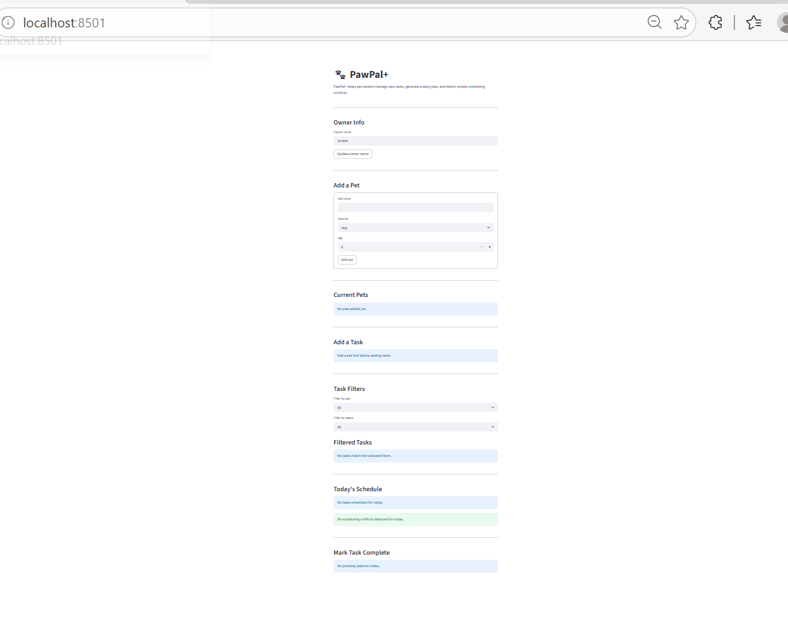

# PawPal+ (Module 2 Project)

You are building **PawPal+**, a Streamlit app that helps a pet owner plan care tasks for their pet.

## Scenario

A busy pet owner needs help staying consistent with pet care. They want an assistant that can:

- Track pet care tasks (walks, feeding, meds, enrichment, grooming, etc.)
- Consider constraints (time available, priority, owner preferences)
- Produce a daily plan and explain why it chose that plan

Your job is to design the system first (UML), then implement the logic in Python, then connect it to the Streamlit UI.

## What you will build

Your final app should:

- Let a user enter basic owner + pet info
- Let a user add/edit tasks (duration + priority at minimum)
- Generate a daily schedule/plan based on constraints and priorities
- Display the plan clearly (and ideally explain the reasoning)
- Include tests for the most important scheduling behaviors

## Getting started

### Setup

```bash
python -m venv .venv
source .venv/bin/activate  # Windows: .venv\Scripts\activate
pip install -r requirements.txt
```

### Suggested workflow

1. Read the scenario carefully and identify requirements and edge cases.
2. Draft a UML diagram (classes, attributes, methods, relationships).
3. Convert UML into Python class stubs (no logic yet).
4. Implement scheduling logic in small increments.
5. Add tests to verify key behaviors.
6. Connect your logic to the Streamlit UI in `app.py`.
7. Refine UML so it matches what you actually built.

## Smarter Scheduling

PawPal+ now includes a smarter scheduling layer with simple algorithms that improve usability:

- **Sorting by time:** Tasks are automatically ordered by due date and time.
- **Filtering:** Tasks can be filtered by pet name or completion status.
- **Recurring tasks:** Daily and weekly tasks automatically generate the next occurrence when completed.
- **Conflict detection:** The scheduler warns the user when multiple tasks are scheduled for the exact same date and time.

## Testing PawPal+

To run the automated tests:

```bash
python -m pytest
```
---

## Confidence section for reflection.md

For section **4b. Confidence**, you can write:

> My confidence level is 4 out of 5. The automated tests cover the main behaviors of the system, including sorting, recurrence, task completion, and conflict detection. I feel confident that the scheduler works correctly for the most common cases. If I had more time, I would test more edge cases such as invalid time formats, weekly recurring tasks, and overlapping task durations instead of only exact time matches.

---

## Good commit commands

```bash
git add .
git commit -m "test: add automated test suite for PawPal+ system"
git push origin main
```
## Features

- Add and manage multiple pets under one owner
- Add pet care tasks with a time, frequency, and due date
- View a daily schedule sorted in chronological order
- Filter tasks by pet name or completion status
- Mark tasks as complete from the app interface
- Automatically generate the next occurrence for daily and weekly recurring tasks
- Detect simple scheduling conflicts when multiple tasks share the same date and time
- Display schedule and warnings clearly in the Streamlit interface

## Demo
<a href="./demo.png" target="_blank"></a>

### Smarter Scheduling section

```md
## Smarter Scheduling

PawPal+ includes a smarter scheduling layer that improves usability for pet owners:

- **Sorting by time:** Tasks are automatically ordered by due date and time.
- **Filtering:** Tasks can be filtered by pet or by completion status.
- **Recurring tasks:** Daily and weekly tasks automatically create the next occurrence when completed.
- **Conflict warnings:** The scheduler detects exact duplicate task times and warns the user in the UI.